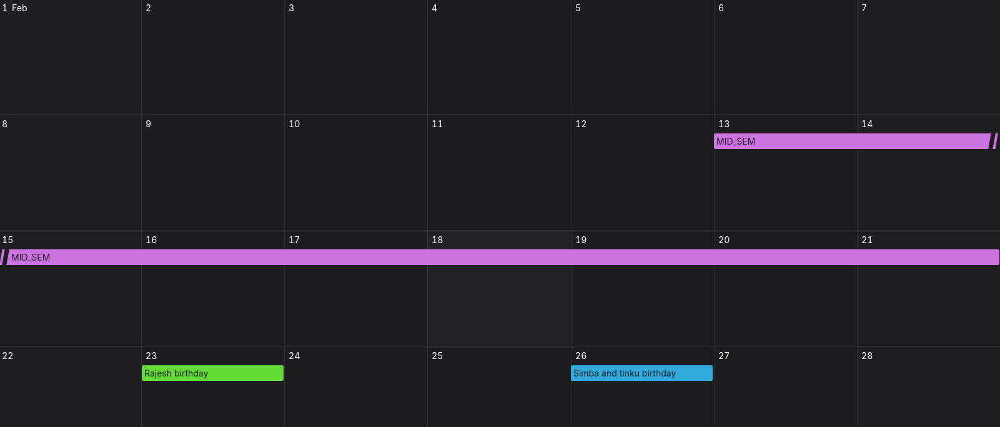

first i need to polish the UI
    1. multipile events on a single day is getting cramped up in that small box ( i need it scrollabe or listing some events and show more like thingy (! idk  which is best you suggest me according UI/UX principles))
    2. i dont want to fixate only few colours like red green blue purple i want to give the users to choose any option like any value
    3. also when a event spans for multiple days it is getting clipped by the grid i want the event indicater to be connected (because event is looking like duplicates )
    
    3. i want the transition between months to be smooth

then we ll move on to Drag and Drop 
and finally to persistance (not local storage lets go with database)

remember my main goal is to learn along the way not just blindly building the component so no problem how much time it takes and explain the new ts or any other new library concepts introduced along the way 